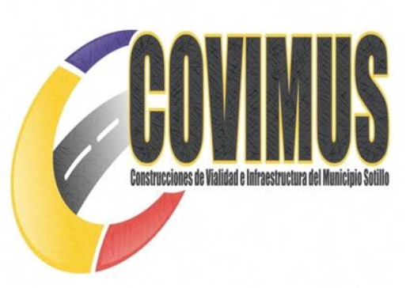
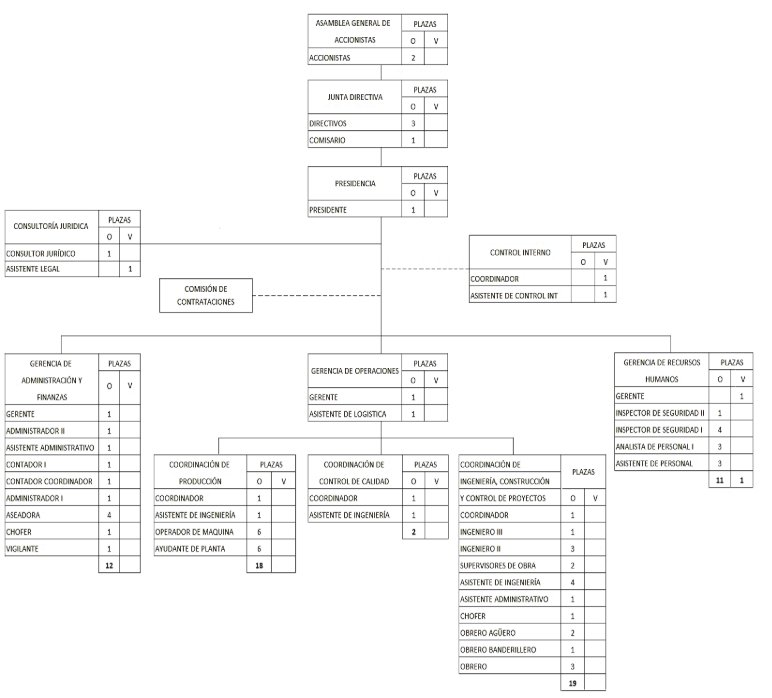

**MANUAL DE ORGANIZACIÓN **

**Enero, 2026** 

**I  CONTENIDO**  

**ÍNDICE  Descripción  Página** 

1. Contenido  2 
2. Introducción  4 
3. Antecedentes Históricos  6 
4. Marco Jurídico-Administrativo  9 
5. Actividad Económica (Atribuciones) 11 
6. Estructura Orgánica y Organizativa  14 
7. Organigrama por Puestos, Plazas y Unidades 16 
8. Misión  17 
9. Visión  18 
10. Valores Organizacionales 19
11. Objetivos, Funciones y Atribuciones Generales 20 

**Detalle por Unidad Administrativa:**
- Asamblea General de Accionistas 21
- Junta Directiva 22
- Presidencia 23
- Consultoría Jurídica 24
- Gerencia de Administración y Finanzas 25
- Gerencia de Operaciones 27
- Gerencia de Recursos Humanos 29

2. **INTRODUCCIÓN** 

El  presente  manual  de  organización  tiene  por  objeto  integrar  en  un  solo documento,  la  información  básica  relativa  a  los  antecedentes,  marco  jurídico- administrativo,  atribuciones,  estructura  orgánica,  visión,  misión,  el  objetivo  y las funciones  de  la  Empresa  de  Producción  Social  Construcciones  de  Vialidad  e Infraestructura  del  Municipio  Sotillo,  (COVIMUS),  S.A.;  contribuyendo  a  la  orientación del personal actual y de nuevo ingreso, facilitando su incorporación a las distintas unidades de adscripción y a la vez proporcionar un esquema funcional que  permita  realizar  estudios  de  reestructuración  administrativa,  cuando  sea necesario.  Constituye,  además,  un  instrumento  de  apoyo  administrativo,  que describe  las  relaciones  orgánicas  que  se  dan  entre  las  distintas  unidades administrativas, siendo ello, un elemento de apoyo para su funcionamiento. 

Conscientes de la importancia que reviste mantener informado a los trabajadores y trabajadoras de las empresas públicas, acerca del objeto y el funcionamiento de la organización para la cual prestan sus servicios, la Empresa ha realizado un estudio organizacional a los fines de establecer claramente su visión, misión, objetivos y funciones generales. 

El manual pretende proporcionar, en forma ordenada, la información básica de la organización  así  como  el  funcionamiento  de  sus  unidades  responsables,  como una  referencia  obligada  para  lograr  el  aprovechamiento  de  los  recursos  y  el desarrollo  de  las  funciones  encomendadas  en  los  Estatutos  Sociales  de  la Empresa. Constituye un medio de familiarizarse con la estructura orgánica y con los  diferentes  niveles  jerárquicos  que  conforman  la  empresa,  por  lo  que  su consulta permite identificar con claridad las funciones y responsabilidades de cada una de las áreas que la integran y evita la duplicidad de funciones. 

A  tales  efectos,  mediante  la  utilización  de  esta  herramienta  de  trabajo  nos esforzamos  por**  establecer  de  manera  inequívoca  la  responsabilidad  de  los trabajadores  y  trabajadoras  que  integran  las  distintas  dependencias  de  la Empresa, para lograr un eficiente y efectivo manejo de los asuntos operativos y administrativos de las distintas unidades de la misma, especialmente en aquellos destinados  a  la  ejecución  de  obras  y  la  producción  de  bienes  o  servicios requeridos  para  satisfacer  las  necesidades  sociales  y  materiales  de  las comunidades que integran el Municipio Juan Antonio Sotillo del Estado Bolivariano de  Anzoátegui,  así  como  también  a  los  organismos  o  instituciones gubernamentales y no gubernamentales que mantienen relación con éste. 

3. **ANTECEDENTES HISTÓRICOS** Características Generales de La Empresa 

   La Empresa fue inscrita en el “Registro Mercantil Tercero” de la Circunscripción Judicial del Estado Anzoátegui, en fecha 08 de Mayo de 2.009, bajo el Nº 21, Tomo A-43, Expediente No. 21; la cual de conformidad con el artículo 1 de su estatuto constitutivo, se denomina: **EPS CONSTRUCCIONES DE VIALIDAD E INFRAESTRUCTURA DEL MUNICIPIO SOTILLO, (COVIMUS, S.A)**. 

**DATOS DE IDENTIFICACIÓN Y CONTACTO**
- **RIF:** G-200088532
- **Email:** covimuscomercial@Gmail.com
- **Teléfono:** (0281)2687758
- **Oficinas Administrativas:** Avenida Municipal, edificio sede de la Alcaldía de Sotillo, piso 1, oficina de Despacho del Alcalde, sector centro, Puerto la Cruz.
- **Oficina de Operaciones:** Vía el Rincón a 100mtrs del Crucero Rincón San Diego, frente al Edén.

   De esta denominación resaltan dos circunstancias relacionadas con la naturaleza jurídica de la empresa: 

1. De  conformidad  con  lo  establecido  en  el  documento  constitutivo, especialmente  en  el  Artículo  5,  EPS  COVIMUS,  es  una  sociedad  anónima 

   constituida  inicialmente  con  un  capital  de  Diez  Millones  de  Bolívares           

   (Bs. 10.000.000,00), divididos en un mil (1000) acciones, a razón de Diez Mil 

   Bolívares  (Bs.10.000,00)  cada  una.  El  capital  fue  aumentado  a                     Bs. 40.000.000,00, mediante capitalización de deuda por Bs. 30.000.000,00, 

   aprobada  el  20-11-2010  en  Asamblea  Extraordinaria  de  Accionistas.  Los 

   accionistas  son:  La  Alcaldía  del  Municipio  Juan  Antonio  Sotillo  del  Estado 

   Anzoátegui, con tres mil novecientas sesenta (3.960) acciones por Treinta y 

   Nueve  Millones  Seiscientos  Mil  Bolívares  (Bs.39.600.000,00),  equivalente  al 

   99% de las acciones y del capital de la empresa, y el “Instituto de Transporte 

   Público  Municipal”  del  mismo  Municipio  Sotillo  del  Estado  Anzoátegui  con 

cuatrocientas (400) acciones por Cuatrocientos Mil Bolívares (Bs.400.000,00) equivalentes al 1% de las acciones y del capital. 

La circunstancia de que la empresa haya sido constituida siguiendo las formas del Código de Comercio como “Sociedad Anónima”, la caracteriza como una “Sociedad  Mercantil”  y  como  tal,  comerciante  según  lo  establecido  en  el artículo  1  del  Código  de  Comercio,  y  a  la  vez  considerado  como  un  ente descentralizado con fines empresariales, a tenor de lo dispuesto en el numeral 2 del Artículo 7 de la Ley Orgánica de la Administración Financiera del Sector Público. 

2. Es una Empresa de Producción Social (E.P.S.). En fecha 12 de Septiembre de 

   2\.005  el  Presidente  de  la  República  dictó  el Decreto Nº 3.895, “Desarrollo Endógeno  y  Empresas  de  Producción”,  el  cual  fue  publicado  en  la Gaceta Oficial Nº 38.271 del 13 de Septiembre del mismo año. En ese Decreto se define  a  la  Empresa  de  Producción  Social  como:  “unidades  de  Producción Comunitaria, constituida bajo la figura jurídica que corresponda con el objeto fundamental  de  generar  bienes  y  servicios  que  satisfagan  las  necesidades básicas y esenciales de la comunidad y su entorno incorporando hombres y mujeres de las misiones, privilegiando los valores de solidaridad, cooperación, complementariedad,  reciprocidad,  equidad,  sustentabilidad,  ante  el  valor  de rentabilidad o ganancia. En  todo  caso,  esas  unidades  económicas  deben  mantener  el  equilibrio financiero que les permita seguir invirtiendo en el mencionado entorno socio- ambiental, en forma sustentable y sostenible. 

En  el  mes  de  junio  de  2.008,  el  Presidente  de  la  República  dictó  el  Decreto          Nº 6.130, con Rango, Valor y Fuerza de Ley de la Economía Popular, en cuyo artículo 5, define a la empresa de producción social, como: “Unidad de traslado colectivo  destinada  a  la  producción  de  bienes  o  servicios  para  satisfacer 

necesidades  sociales  y  material,  a  través  de  la  reinversión  social  de  sus excedentes, con igualdad sustantiva de sus integrantes.” 

EPS COVIMUS, S.A. es una empresa de producción social, creada bajo la forma jurídica  de  “Sociedad  Anónima”, en consecuencia, es una sociedad mercantil, y como  tal,  debe  procurar  la  rentabilidad y ganancia de sus accionistas, en este caso, La Alcaldía del Municipio Juan Antonio Sotillo del Estado Anzoátegui en un 99%, y el Instituto de Transporte Público Municipal del mismo Municipio en un 1%. Como  empresa  de  producción  social,  debe  generar  bienes  y  servicios  que satisfagan las necesidades básicas y esenciales de la comunidad y su entorno, anteponiendo valores como la solidaridad, cooperación y sustentabilidad a los de rentabilidad  o  ganancia,  pero  cuidando  mantener  el  equilibrio  financiero  que  le permita  seguir  invirtiendo  en  el  entorno  socio-ambiental  de  forma sustentable y sostenible. 

La  Empresa  fue  creada  bajo  las  consideraciones  establecidas  en  el  Decreto Nº3.895 “Desarrollo Endógeno y Empresas de Producción Social” dictado por el Presidente de la República el 12 de Septiembre de 2.005 y publicado el 13 de Septiembre del mismo año, que establece la posibilidad de crear estas empresas bajo  la  forma  jurídica  de  Sociedad  Anónima,  así  que  es  una  empresa  regida fundamentalmente  por  las  normas  del  “Código  de  Comercio”,  por  las cláusulas establecidas en el documento constitutivo y por el Decreto antes citado. 

El  Decreto  Nº  6.130,  con  rango,  valor  y  fuerza  de  Ley  para  el  Fomento  y Desarrollo de la Economía Popular, en su Artículo 9, define a las empresas de producción social, en los siguientes términos: 

“Empresa  de  Producción  Social:  Unidad  de  traslado  colectivo  destinada  a  la producción de bienes o servicios para satisfacer necesidades sociales y material, a través de la reinversión social de sus excedentes, con igualdad sustantiva de sus integrantes”. 

4. **MARCO JURÍDICO-ADMINISTRATIVO** 

Para  la  elaboración  del  presente  Manual  de  Organización,  se  consideraron  los instrumentos legales siguientes: 

- Constitución de la República Bolivariana de Venezuela (G.O. Nº 36.860 del 30-12-1999) 
- Ley  Orgánica  del  Trabajo,  los  Trabajadores  y  las  Trabajadoras  (G.O.         Nº 6.076 Extraordinario del 07-05-2012). 
- Ley Orgánica de la Administración Pública (G.O. Nº 38.146 del 25-03-2009) 
- Ley  Orgánica  de  la  Administración  Financiera  del  Sector  Público  (G.O.       Nº 40.311 del 09-12-2013) 
- Ley  Orgánica  del  Poder  Público  Municipal  (G.O.  Nº 6.015 Extraordinario  

  del 28-12-2010) 

- Ley  Orgánica  de  la  Contraloría  General  de  la  República  y  del  Sistema Nacional de Control Fiscal (G.O. Nº 37.347 del 17-12-2001) 
- Ley  Orgánica  de  la  Hacienda  Pública  (G.O.  Nº  1660  extraordinario  del       26-06-1974) 
- Ley  Orgánica  de  Prevención,  Condiciones  y  Medio  Ambiente  de  Trabajo (G.O. Nº 39.846 del 19-01-2012) 
- Código Orgánico Tributario (G.O. Nº 37.305 del 17-10-2001) 
- Decreto  Nº  3.895  del  12-09-2.005  “Desarrollo  Endógeno y Empresas de Producción Social” (G.O. Nº 38.271 del 13-09-2005) 
- Decreto Nº 6.130, con Rango, Valor y Fuerza de Ley para el Fomento y Desarrollo  de  la  Economía  Popular  (G.O.  Nº  5.890  Extraordinario  del       30-07-2008). 
- Decreto con Rango y Fuerza de la Ley de Reforma Parcial de la Ley de Contrataciones Públicas (Gaceta Oficial Nº 39.503 del 06-09-2010). 

- Reglamento sobre la Organización del Control Interno en la Administración Pública Nacional (G.O. Nº 37.783 del 25-09-2003). 
- Reglamentos de la Ley Orgánica de la Administración Financiera del Sector Público Nº 1, 2, 3 y 4 (G.O. Nº 5.781 Extraordinario del 12-08-2005; G.O.    Nº 38.117 del 28-01-2005; G.O. Nº 38.433 del 10-05-2006 y G.O. Nº 38.333 del 12-12-2005) 
- Reglamento de la Ley de Contrataciones Públicas (Gaceta Oficial Nº 39.181 del 19-05-2009) 
- Reglamento de la Ley Orgánica de la Contraloría General de la República y del Sistema Nacional de Control Fiscal (G.O. Nº 39.729 del 05-08-2011) 
- Normas Generales de Control Interno (G.O. Nº 36.229 del 17-06-1997) 
- Manual  de  Normas  de  Control  Interno  sobre  un  Modelo  Genérico  de  la Administración Central y Descentralizada Funcionalmente (G.O. Nº 38.282 

  del 28-09-2005).    

5. **ACTIVIDAD ECONÓMICA (ATRIBUCIONES)** 

Realizar las operaciones y gestiones necesarias para la obtención de financiamiento a través de entes públicos y privados, nacionales o internacionales para la realización de todos los proyectos que pretenda desarrollar la empresa: planificar e impulsar el trabajo colectivo, social y popular como actividad socio-productiva y económica en el país así como también fomentar la conformación de redes sociales en las comunidades que coadyuven al mejoramiento de la calidad de vida de nuestra población, ejecución de proyectos de infraestructura, vialidad y/o servicios conexos, construcción de obras civiles, edificaciones, acueductos, movimientos de tierra y demoliciones, instalación y construcción de obras eléctricas de alta y baja tensión, elaborar fabricar, vender y distribuir materiales y componentes para la construcción en todas sus clases.

Para el cumplimiento de este objeto, la Sociedad tendrá las siguientes atribuciones: 

- Planificar, programar, diseñar, ejecutar, mantener, administrar y aprovechar las Obras de Infraestructura vial de interés público y privado. 
- Realizar todos los trámites necesarios para entregar concesiones y contrataciones a las empresas públicas o privadas tomando en cuenta modalidades cooperativas, empresas de Producción Social y Concejos Comunales para la conservación y aprovechamiento de carreteras, puentes y autopistas.
- Coordinar y ejecutar las obras relativas al equipamiento de la ciudad, poblados, barrios y urbanizaciones populares incluyendo los servicios de deforestación, poda, reforestación, ornamentación de parques, instalaciones, zonas recreativas, plazas, caminarías, bulevares, paseos, balnearios, ríos, edificaciones, estacionamientos, canchas deportivas, avenidas y calles; instalaciones decorativas entre otros.
- Coordinar y ejecutar proyectos de vialidad como carreteras y caminos en concreto y asfalto frio o caliente así como también servicios de caminos vecinales para la agricultura. 
- Planificación y ejecución de los acueductos rurales y urbanos y la coordinación de los distintos órganos de esta materia. 
- Ejercer las competencias delegadas en materia de vialidad, en forma directa, con sus propios medios y organización o bien en forma indirecta a través de convenios de delegación de administración y operación de servicios para el aprovechamiento de tramos viales otorgados a empresas públicas o privadas. 
- Inspección, supervisión y evaluación de obras contratadas por el Municipio y de las coordinadas con los demás niveles de gobierno conforme a los acuerdos que suscribe la administración de la Empresa.
- Preparar presupuestos base para la contratación de obras, de acuerdo con la información contenida en sus propias registros y coadyuvar en los procesos de contrataciones, conforme a los dispuestos en las normativas vigentes sobre la materia.
- Trabajos de ingeniería, ejecución de cálculos, estudio y dirección de obras estructurales, demolición y transporte de escombros. 
- Suministro de materiales y equipos de seguridad, asesoría general e industrial en seguridad, venta de equipos de mantenimiento, servicios construcciones e instalaciones eléctricas.
- Asesorar y asociarse con Concejos Comunales (unidades financieras).
- Servicios de transporte, automotor y marítimo, de pasajeros, bien sea ejecutivo, escolar, público y privado, de carga pesada y liviana.
- Venta de equipos, de bienes muebles e inmuebles. 
- Todo lo relativo a venta y distribución de accesorios y repuestos para vehículos, mecánica metalmecánica, todo lo relacionado con instalación de tuberías y cloacas, SAND BLASTING de estructuras y tuberías.
- Realizar obras menores, cercas, techos rasos, albañilería, carpintería, herrería, impermeabilización de edificaciones, construcción de oleoductos, gasoductos, poliductos, perforación y mantenimiento de pozos de agua.
- Trabajos de soldadura, pinturas de exteriores e interiores y pintura industrial, servicios de refrigeración industrial, comercial y domestica.
- Organizar, planificar y desarrollar programas y proyectos sociales, desarrollo de programas alimentarios y de salud; así mismo, todo lo concerniente al saneamiento ambiental. 
- Organización de banquetes y reuniones para todo tipo de eventos, venta y alquiler de toldos, tarimas, sonido, servicios de festejo y eventos en general.
- Elaboración, presentación de proyectos de cualquier índole y cualquier actividad de licito comercio.

La compañía seguirá el modelo de empresas de producción social (EPS) y por lo tanto manifiesta su voluntad de acogerse este programa el cual esta compuesto por un conjunto de compromisos vinculados a la participación activa del capital privado en las contrataciones que realiza PDVSA y sus filiales, encaminadas al desarrollo económico y social del país, los cuales están construidos por: 

A) La participación en el fondo social de PDVSA. 
B) Presentar oferta social en los procesos licitatorios, concepto basado en la necesidad de realizar obras, prestar servicios y/o proveer bienes, para atender necesidades de las comunidades de manera de asegurar su desarrollo armónico y sustentable.
C) Desarrollar y acompañar a empresas pequeñas y EPS, lo cual incluye apoyar todo el desarrollo de sistemas y tecnologías y establecer programas permanentes que permitan la inserción de estas empresas en el sistema productivo.
D) Consorciarse con empresas medianas y EPS, a los fines de fortalecerlas tecnológicamente permitiendo un valor agregado Nacional incrementar, y una mayor inserción en la solución y necesidades vinculadas a las áreas operacionales en el sector petrolero.
E) Contribución al desarrollo de empresas producción distribución y servicios comunal. Estos compromisos se ejecutarán en la relación a la suscripción de un contrato con PDVSA.

6. **ESTRUCTURA ORGÁNICA Y ORGANIZATIVA** 

|**1.  Asamblea General de Accionistas** |
| - |
|**2.  Junta Directiva** |
|**3.  Presidencia** |
|
3.1 Comisión de Contrataciones 

3.2 Control Interno 
|
|**4.  Consultoría Jurídica** |
|
**5.  Gerencia de Administración y Finanzas** 

5.1 Facturación y Cobranzas 

5.2 Compras y Suministros 

5.3 Contabilidad 

5.4 Servicios Generales 

5.5 Archivo y Correspondencia 
|
|
**6.  Gerencia de Operaciones** 

6.1 **Coordinación de Producción** 

6.1.1. Producción 

6.1.2. Mantenimiento 

6.2 **Coordinación de Control de Calidad-QAQC** 

6.2.1 Laboratorio 

6.2.2 Inventario y Control de Materia Prima 

6.3 **Coordinación de Ingeniería, Construcción y Control de Proyectos** 

6.3.1 Sala Técnica  

6.3.2 Estimación de Costos y Análisis de Precios Unitarios (APU) 

6.3.3 Planificación, Control y Seguimiento  
|
|
**7.  Gerencia de Recursos Humanos** 

7.1 Nómina 

7.2 SIHAO 

7.3 Bienestar Social 
|

\* No contempla niveles jerárquicos 

7. **ORGANIGRAMA POR PUESTOS, PLAZAS Y UNIDADES** 

**O=Ocupado; V=Vacante** 

8. **MISIÓN**  

Producir bienes o servicios para satisfacer necesidades sociales y materiales a través de la reinversión social de sus excedentes cuya propiedad es ejercida por el Estado en nombre de la comunidad en beneficio del colectivo; en la promoción, financiamiento y ejecución de programas, proyectos y obras públicas en materia de  ingeniería,  infraestructura  en  todo  el  territorio  venezolano,  garantizando  la calidad y cumpliendo con los más altos estándares de seguridad, salud, higiene y ambiente. 

9. **VISIÓN** 

Ser reconocida como una Empresa de Producción Social, de Servicios, Mantenimiento y Construcción del sector Público, Petrolero y Petroquímico, a nivel nacional con los más altos estándares de desempeño.

10. **VALORES ORGANIZACIONALES**

- **Conciencia del Deber Social:** Es la actitud permanente de servicio, orientada a la participación ciudadana. Implica el desarrollo de iniciativas solidarias, abocadas al control fiscal sobre las bases jurídicas vigentes en la materia. Conciencia del Deber Social es la conciencia de la pertenencia a la sociedad, el convencimiento de que la suerte de la sociedad depende del esfuerzo de cada uno de sus hijos, y que la suerte de cada uno de los individuos depende de la suerte de la sociedad toda, la certeza de la imposibilidad de las salidas individuales a los grandes problemas sociales. Se establece así la sociedad del amor.
- **Compromiso Organizacional:** Es la capacidad de conocer y comprender la estructura de la organización y orientar su actuación profesional de acuerdo con los valores, principios y objetivos de la misma.
- **Visión de Futuro:** Es la capacidad de visualizar a la Institución como un organismo de excelencia en la Administración Pública, orientando sus acciones a la consecución de metas y objetivos institucionales.

11. **OBJETIVOS, FUNCIONES Y ATRIBUCIONES GENERALES** 

**OBJETIVO GENERAL**

La Sociedad tendrá por objeto crear una unidad de trabajo colectiva destinada a la producción de bienes o servicios para satisfacer necesidades sociales y materiales a través de la reinversión social de sus excedentes, cuya propiedad es ejercida por el Estado en nombre de la comunidad en beneficio del colectivo; en la promoción, financiamiento y ejecución de programas, proyectos y obras públicas en materia de ingeniería, infraestructura y afines, así como la conservación administración y aprovechamiento de las carreteras, puentes, autopistas, incluyendo la vialidades agrícolas que se encuentran en el territorio del Municipio.

**OBJETIVOS ESPECÍFICOS**

- Continuar fortaleciendo las políticas socialistas y Bolivarianas en materia de infraestructura, vialidad y saneamiento ambiental del municipio.
- Mejorar el mantenimiento, limpieza, reparación y asfaltado del Municipio Juan Antonio Sotillo.
- Coordinar y ejecutar obras relativas al equipamiento del municipio.
- Coordinar y ejecutar proyectos de vialidad como carreteras y caminos en concreto y asfalto frio o caliente; así como servicios de caminos vecinales para la agricultura.
- Planificar y ejecutar acueductos rurales y urbanos en coordinación con los Órganos componentes en esta materia. Inspeccionar y evaluar las obras contratadas por el municipio y las coordinadas por los demás niveles de gobierno.
- Preparar presupuestos base para la contratación de obras y coadyuvar en los procesos de contratación.
- Realizar las operaciones y gestiones necesarias para la obtención de financiamiento a través de entes públicos y privados, nacionales o internacionales para la realización de proyectos de vialidad y servicios conexos.

COVIMUS, S.A., es una Empresa de vanguardia en materia de Construcción y asfaltado dentro del Municipio Juan Antonio Sotillo y así siguiendo las consideraciones establecidas en las normativas que rige la materia de planificación, consolidó el Plan Operativo Anual Municipal.

Para cumplir con ese objeto cuenta con una serie de dependencias sustantivas y de apoyo que en forma conjunta contribuyen al logro del referido objeto de creación. Los objetivos y funciones, discriminadas por dependencia, se señalan a continuación:

**IDENTIFICACIÓN** 

1. **Asamblea General de Accionistas** Adscripción Jerárquica y Funcional: Accionistas.** 

**OBJETIVO** 

De  acuerdo  con  lo  previsto  en  el  Artículo  12  de  los  Estatutos  Sociales,  es  el órgano supremo de la Sociedad, está investida de las más amplias facultades de dirección, administración y disposición de los negocios y bienes de la Sociedad.  

**IDENTIFICACIÓN** 

2. **Junta Directiva** 

Adscripción Jerárquica y Funcional:    Asamblea General de Accionistas 

**OBJETIVO** 

De conformidad con lo previsto en los Artículos 17 y 20 de sus Estatutos Sociales, tiene  a  su  cargo  dirigir  y  administrar  la  Sociedad,  para  lo  cual  tiene  los  más amplios poderes de administración y disposición.  

**FUNCIONES Y ATRIBUCIONES GENERALES** 

De acuerdo con lo establecido en el Artículo 20 de sus Estatutos Sociales, tiene los  más  amplios  poderes  de  administración  y  disposición,  además  de  aquellas otras  que  le  estuvieren  especialmente  encomendadas  por  la  ley  o  por  los Estatutos. En tal sentido, ejerce las siguientes atribuciones: 

1) Disponer  las  convocatorias  de  las  asambleas  generales  de  accionistas  y cumplir y hacer cumplir sus decisiones y acuerdos.  
1) Aprobar  las  estructuras  organizativas,  normas  y  procedimientos  de  la sociedad;  
1) Establecer oficinas, organizaciones, subsidiarias o agencias y decidir sobre la intervención  de  la  sociedad  en  la  producción  o  comercialización  de  nuevos servicios o productos;  
1) Aprobar los planes de trabajo y los presupuestos de la sociedad y estimar los gastos necesarios para el funcionamiento; 
1) Resolver la venta, enajenación, cesión, traspaso, arrendamiento y gravamen de los bienes muebles e inmuebles de la sociedad; 

6) Resolver el otorgamiento de toda clase de garantía hipotecaria, prendaria o fiduciaria;  
6) Resolver que se intenten acciones judiciales y se desista de ellas;  se hagan transacciones y posturas en remates judiciales; se contradigan las acciones intentadas contra la Sociedad o se convengan en ellas; y se comprometa en árbitros, arbitradores o de derecho;  
6) En  general,  que  se  haga  uso  de  toda  clase  de  acciones  y  recursos  ante cualesquiera autoridades públicas, judiciales o administrativas, para la defensa y resguardo de los intereses de la sociedad;  
6) Acordar  el  otorgamiento  de  poderes  generales  o  especiales  para determinados asuntos y para la representación en juicio de la sociedad;  
6) Ordenar auditorías;  
6) Presentar  los  balances,  estados  financieros  y  demás  informes  que  deben presentarse al comisario y a la asamblea;  
6) Crear los fondos de amortización y demás apartados. La anterior enumeración de atribuciones no es restrictiva y, por lo tanto, no limita los poderes de la junta directiva  que  son  plenos  mientras  la  asamblea  no  esté  reunida,  y  está facultada para representar a la sociedad por intermedio de su Presidente o cualesquiera de sus miembros expresamente autorizados sin reserva alguna de  todo  aquello  que  no  esté  atribuido  a  la  asamblea  o  a  competencia  de determinados  funcionarios  por  la  ley  o  este  documentos  constitutivo 

   estatutario. 

**IDENTIFICACIÓN** 

3. **Presidencia** 

   **Presidente:** Ing. Oswaldo González
   Adscripción Jerárquica y Funcional:    Junta Directiva 

**OBJETIVO** 

Representar a la empresa con las más amplias facultades para suscribir en su nombre todo tipo de documento derivado de su gestión diaria, así como velar por la ejecución de todas las operaciones de la sociedad y firmar por ella y obligarla en todos los contratos.  

**FUNCIONES Y ATRIBUCIONES GENERALES** 

Según  lo  dispuesto  en  el  Artículo  21  de  sus  Estatutos  Sociales,  tiene  las atribuciones siguientes: 

1) Presidir las asambleas de la sociedad y las reuniones de la Junta Directiva;  
1) Comunicar a la Asamblea y a la Junta Directiva los asuntos que deba conocer; 
1) Representar a la empresa con las más amplias facultades para suscribir en su nombre todo tipo de documento derivado de su gestión diaria, así como velar por la ejecución de todas las operaciones de la sociedad y firmar por ella y obligarla en todos los contratos;  
1) Nombrar y remover a los funcionarios y empleados;  
1) Abrir  y  movilizar  cuentas  bancarias  y  hacer  depósitos  en  nombre  de  la sociedad; 
1) Autorizar toda clase de contratos;  
1) Resolver  el  otorgamiento  de  anticipos,  préstamos  o  créditos  en  cualquier forma;  
1) Autorizar  al  Representante  Judicial  para  otorgar  poderes  generales  o especiales para determinados asuntos y para la representación en juicios de la sociedad;  
1) Las demás que la Junta Directiva le señale o la Asamblea General le asignare. 

**IDENTIFICACIÓN** 

1. **Comisión de Contrataciones** Adscripción Jerárquica y Funcional:  Presidencia de la Empresa 

**OBJETIVO** 

Organizar,  dirigir  y  controlar  eficientemente  los  procesos de  contrataciones públicas  adelantadas  por  la  Empresa  para  la  contratación  de  obras, adquisición de bienes y/o servicios necesarios para el buen funcionamiento de la  misma,  de  conformidad  con  lo  previsto  en  la  Ley  de  Contrataciones Públicas y su Reglamento.  

**FUNCIONES Y ATRIBUCIONES GENERALES:** 

1. Organizar,  dirigir  y  controlar  los  procesos  de  contrataciones  públicas, mediante  la  aplicación de los procedimientos y modalidades de  selección y contratación  (concurso  abierto,  concurso  cerrado,  consulta  de  precios  y contratación  directa),  previstos  en  la  Ley  de  Contrataciones  Públicas,  su Reglamento y demás disposiciones legales que rigen sobre la materia. 
1. Convocar a las empresas que deseen participar en los procesos de selección y contratación. 
1. Coordinar  todas  las  reuniones  necesarias  a  los  fines  de  adelantar  tales procesos. 
1. Planificar las diferentes fechas en que se realizarán los procesos de selección y contrataciones públicas.  
1. Elaborar las actas de los respectivos procesos.  
1. Redactar  y  mandar  a  publicar  los  avisos  de  prensa  relacionados  con  los procesos de selección y contratación. 
1. Elaborar los pliegos de condiciones que contienen toda la información sobre 

los actos. 

8. Someter  a  consideración,  para  la  aprobación  del  Presidente  y  la  Junta Directiva de la Empresa, un informe de recomendación, con el resultado del proceso de selección de la empresa.  
8. Solicitar la elaboración de los contratos, órdenes de compra o de servicios para las empresas beneficiadas con la adjudicación. 

**IDENTIFICACIÓN** 

2. **Control Interno** 

   Adscripción Jerárquica y Funcional:  Presidencia de la Empresa 

El sistema de control interno es parte de los sistemas financieros, presupuestarios, contables,  administrativos  y  operativos  del  organismo  o  entidad  y  no  un  área independiente, individual  o especializada. 

**OBJETIVO** 

Organizar, mantener y evaluar el sistema de control interno adoptado dentro de la Empresa, para salvaguardar sus recursos, verificar la exactitud y veracidad de la información financiera y administrativa, promover la eficiencia, economía y calidad en sus operaciones, estimular la observancia de las políticas prescritas y lograr el cumplimiento de su misión, objetivos y metas. 

**FUNCIONES Y ATRIBUCIONES GENERALES** 

Las funciones y atribuciones relacionadas con el ejercicio del control interno en la Empresa  están  relacionadas  con  las  normas  e  instrucciones  dictadas  por  los organismos  rectores  integrantes  del  Sistema  Nacional  de  Control  Fiscal (Contraloría  General  de  la  República  y  Superintendencia  Nacional  de  Auditoría 

Interna), especialmente las Normas Generales de Control Interno (G.O. Nº 36.229 del  17-06-1997),  el  Manual  de  Normas  de  Control  Interno  sobre  un  Modelo Genérico  de  la  Administración  Central  y  Descentralizada  Funcionalmente  (G.O.  Nº  38.282  del  28-09-2005),  el  Reglamento  sobre  la  Organización  del  Control Interno en la Administración Pública (G.O. Nº 37.783 del 25-09-2003), dictado por el  Presidente  de  la  República  Bolivariana  de  Venezuela,  así  como  las  normas referentes al Sistema de Control Interno contenidas en las Leyes y Reglamentos, tales como: Ley Orgánica de la Contraloría General de la República y del Sistema Nacional de Control Fiscal y su Reglamento, Ley Orgánica de la Administración Financiera del Sector Público y sus Reglamentos. A tales efectos, le corresponde: 

1. Revisar y evaluar el sistema de control interno, para proponer al Presidente de la  Empresa  y  La  Junta  Directiva  las  recomendaciones  tendentes  a  su optimización  y  al  incremento  de  la  eficacia  y  efectividad  de  la  gestión 

   administrativa. 

2. Velar  porque  los  deberes  y  responsabilidades  atinentes  a  la  autorización, ejecución, registro, control de transacciones y custodia del patrimonio público,  estén adecuada y perceptiblemente delimitados. 
2. Someter a pruebas selectivas y continuas de cumplimiento y exactitud a los sistemas y mecanismos de control interno financiero, presupuestario, contable, administrativo y operativo de la empresa.  

   Las pruebas de cumplimiento están dirigidas a determinar sí dichos sistemas y mecanismos permiten detectar con prontitud cualquier desviación en el logro de las metas y objetivos programados, y en la adecuación de las acciones administrativas, presupuestarias y financieras a los procedimientos y normas prescritas.  Las  pruebas  de  exactitud  están  referidas  a  la verificación de la congruencia  y  consistencia  numérica  que  debe  existir  en  los  registros contables entre sí y en los estadísticos, y a la comprobación de la ejecución física de tareas y trabajos. 

4. Velar porque las políticas que dicte la Empresa estén definidas por escrito; que  las  decisiones  que  se  adopten  estén  dirigidas  a  procurar  la  debida concordancia  y  adecuación  de  la  empresa  con  sus  planes  y  programas,  a establecer mecanismos para ejercer el control de las actividades de acuerdo con lo programado y a motivar al personal en la consecución de los objetivos y metas establecidos. 
4. Verificar que los niveles directivos y gerenciales de la empresa: 
   1) Vigilen  permanentemente  la  actividad  administrativa  de  las  unidades, programas, proyectos u operaciones que tienen a su cargo; 
   1) Sean diligentes en la adopción de las medidas necesarias ante cualquier evidencia de desviación de los objetivos y metas programadas, detección de irregularidades o actuaciones contrarias a los principios de legalidad, economía, eficiencia y/o eficacia; 
   1) Se  aseguren  que  los  controles  internos  contribuyan  al  logro  de  los resultados esperados de la gestión. 
   1) Evalúen  las  observaciones  y  recomendaciones  formuladas  por  los organismos  y  dependencias  encargados  del control externo e interno, y promuevan la aplicación de las respectivas medidas correctivas. 
4. Cerciorarse  que  estén  claramente  definidas,  por  escrito,  las  normas  e instrucciones de la empresa, así como las funciones de cada cargo, su nivel de  autoridad,  responsabilidad  y  sus  relaciones  jerárquicas  dentro  de  la estructura  organizativa,  procurando  que  el  trabajador  o  trabajadora  sea responsable de sus actuaciones ante una sola autoridad. 
4. Velar que los manuales técnicos y de procedimientos sean aprobados por el Presidente  y  la  Junta  Directiva  de  la  Empresa,  y  que  además incluyan los diferentes  pasos  y  condiciones  de  las  operaciones  a  ser  autorizadas, aprobadas,  revisadas  y  registradas,  así  como  lo  relativo  al  archivo  de  la documentación justificativa que le sirva de soporte. 

8. Verificar  que  todas  las  transacciones  y  operaciones  financieras, presupuestarias y administrativas realizadas en la empresa estén respaldadas con  la  suficiente  documentación  justificativa.  A  tales  efectos,  deberá asegurarse:  
   1) Que los documentos contengan información completa y exacta, se archive siguiendo un orden cronológico u otros sistemas de archivo que faciliten su oportuna  localización,  y  se  conserven  durante  el  tiempo  estipulado legalmente. 
   1) Que  los  gerentes,  coordinadores  y  supervisores  de  las  distintas dependencias  de  la  empresa  adopten  las  medidas  necesarias  para salvaguardar  y  proteger  los  documentos  contra  incendios,  sustracción  o cualquier  otro  riesgo,  e  igualmente,  para  evitar  su  reproducción  no autorizada. 
8. Vigilar que se haya establecido un adecuado sistema de contabilidad para el registro oportuno y funcional de las operaciones financieras realizadas por la empresa.  Asimismo,  que  los  asientos  contables  sean  aprobados  por  un funcionario  competente,  con  el  propósito de garantizar la correcta y exacta imputación en cada cuenta de control. 
8. Velar porque el sistema de contabilidad provea la información necesaria para elaborar,  en  el  tiempo  previsto,  el  balance  de  comprobación y los estados financieros de la empresa. 
8. Verificar, mediante pruebas de cumplimiento, que el sistema de comunicación y  coordinación  implantado  y  mantenido  en  la  empresa,  provea  información relativa  a  las  operaciones,  confiable,  oportuna,  actualizada  y  acorde  a  sus necesidades. 
8. Realizar el control previo al compromiso y al pago 
8. Cualquier otra función que se le asigne, relacionada con el ejercicio del control interno en la empresa. 

**IDENTIFICACIÓN** 

**4.  Consultoría Jurídica** 

   **Consultor Jurídico:** Abg. Eduardo Chivico
   Adscripción Jerárquica y Funcional:    Presidencia de la Empresa 

**OBJETIVO:** 

Brindar  asesoría  jurídica  y  asistencia  legal  a  todas  las  dependencias  de  la Empresa, para permitir el buen funcionamiento de la misma. 

**FUNCIONES GENERALES** 

La Consultoría Jurídica** tiene asignada** las funciones siguientes: 

1. Prestar  asesoría  legal  al  Presidente  de  la  empresa,  así  como  ejercer  la dirección y coordinación de todo asunto de contenido legal que sea sometido a su consideración. 
1. Asistir a la Empresa o ejercer su representación judicial, previa  autorización por  escrito  del  Presidente,  en  los  casos  que  se  ventilen  en   las  distintas jurisdicciones nacionales, relacionados con las actuaciones de  La Empresa, de conformidad con la Ley. 
1. Coordinar  las  relaciones  de  la  Empresa  con  el  Ministerio  Público,  la Procuraduría General de la República, la Sindicatura Municipal, la Contraloría Municipal  y  demás  órganos  del  poder  público  relacionados  con  sus atribuciones. 
1. Asistir  al  Presidente  en el estudio de los recursos de reconsideración y de revisión  interpuestos  contra  los  actos  administrativos  emanados  de  La Empresa. 

5. Emitir dictámenes y absolver las consultas sobre asuntos jurídicos formulados por el Presidente y demás Gerentes y Coordinadores de las Gerencias de la Empresa.  
5. Compilar las leyes, decretos, resoluciones, ordenanzas y demás actos que se refieran a la Empresa, así como seleccionar, sistematizar y divulgar la doctrina y jurisprudencia que versen sobre materias de la competencia de la misma. 
5. Asesorar en materia jurídica a las demás dependencias de la Empresa. 
5. Elaborar en coordinación con las demás Gerencias de la Empresa, aquellos proyectos  de  contratos  que  haya  de  celebrar  el  Presidente  o  cualquier funcionario delegado por éste, que así lo requieran. 
5. Elaborar el proyecto de presupuesto, el plan operativo anual y el informe de gestión  de  la  Consultoría,  a  los  fines  de  su  integración  al  presupuesto  de gastos, al plan operativo anual y al informe de gestión de la Empresa. 
5. Llevar  un  control  administrativo  de  toda  información  o  documentación,  en general, producida y recibida por la Gerencia.  
5. Las demás que le asigne el Presidente. 

Corresponde  al  Consultor  o  Consultora  Jurídico  dirigir,  coordinar  y  ejecutar las actividades necesarias para el cabal cumplimiento de las funciones asignadas a la Consultoría  Jurídica,  en  tal  sentido,  deberá  supervisar  y  evaluar  el  personal adscrito, salvaguardar los bienes muebles y recursos asignados a la misma, así como la certificación de las copias fotostáticas de los documentos que reposan en los archivos de la Consultoría Jurídica y remitirlos al Despacho del Presidente de la Empresa para su tramitación definitiva. 

**IDENTIFICACION** 

**5.  GERENCIA DE ADMINISTRACIÓN Y FINANZAS** 

   **Gerente de Admón y Finanzas:** Lcda. Ramona Sánchez
Adscripción Jerárquica y Funcional** Presidencia de la Empresa 

Estructura de la Gerencia: 

Compras  y  Suministros;  Facturación  y  Cobranzas,  Contabilidad,  Archivo  y Correspondencia, Servicios Generales.  

**OBJETIVO** 

Ejecutar, coordinar y supervisar las actividades en materia de gestión financiera de los  servicios  administrativos;  dirigir  y  controlar  la  ejecución  del  presupuesto  de ingresos  y  gastos,  tramitar  la  captación  de  los  ingresos  y  los  compromisos correspondientes, así como la prestación de los servicios necesarios para el buen funcionamiento de la empresa. 

**FUNCIONES Y ATRIBUCIONES GENERALES**     

La  Gerencia  de  Administración  y  Finanzas,  tiene  asignada  las  funciones  y atribuciones siguientes: 

1. Dirigir,  coordinar  y  elaborar  anualmente  el  Proyecto  de  Presupuesto  de Ingresos y Gastos, para su presentación y aprobación del Presidente de la Empresa, la Junta Directiva y los Accionistas. 
1. Coordinar la elaboración del Informe de Gestión de la Empresa, a los fines de su presentación al Presidente y la Junta Directiva, y su posterior remisión a la Alcaldía Municipal. 
1. Elaborar el Plan Operativo Anual de la Gerencia y de la Empresa. 

4. Coordinar y elaborar los proyectos de modificaciones presupuestarias para su presentación al Presidente de la Empresa para su aprobación.  
4. Dirigir y programar la ejecución física y financiera del presupuesto de ingresos y gastos de la Empresa. 
4. Adquirir  y  ejecutar,  conjuntamente  con  el  Presidente  de  la  Empresa,  los compromisos  (contratos  de  obras,  órdenes  de  compra  o  de  servicios  y contratos  especiales)  y  desembolsos  para  la  cancelación  de  aquellos  que estén  debidamente  causados  o  ejecutados;  supervisar  que  todos  los compromisos  adquiridos  se  realicen  con  cargo  a  las  partidas  de  gastos previstas. 
4. Realizar, en coordinación con la  Gerencia de Recursos Humanos, los pagos de remuneraciones al personal y las retenciones, que en materia de seguridad social establezcan las leyes, así como enterar las mismas a los organismos correspondientes, junto con los correspondientes aportes patronales. 
4. Suministrar información permanente al Presidente, acerca de los resultados de las finanzas de la Empresa y su gestión, así como cualquier otra información que sea necesaria. 
4. Elaborar y analizar periódicamente la situación presupuestaria y financiera de la Empresa. 
4. Coordinar  con  la  Consultoría  Jurídica,  la  elaboración  de  aquellos  contratos (obras, bienes o servicios) que haya de celebrar el Presidente de la Empresa, y velar por su ejecución, salvo en los casos en que, de conformidad con el presente Manual, la coordinación del respectivo contrato le corresponda a la Gerencia de Recursos Humanos. 
4. Hacer seguimiento, control y evaluación de la ejecución física y financiera del presupuesto de ingresos y gastos, y advertir oportunamente al Presidente de la Empresa acerca de las posibles desviaciones o debilidades que pudieran presentarse, para su debida corrección. 

12. Asistir y asesorar al Presidente de la Empresa y a las dependencias que la conforman,  en  materia  de  planificación,  presupuesto,  estadísticas, organización y sistemas y control de gestión. 
12. Recibir, colocar y manejar, de acuerdo con las instrucciones del Presidente de la  Empresa,  los  recursos  financieros  y  efectuar  las  demás  tramitaciones administrativas relacionadas con los mismos. 
12. Coordinar y supervisar el sistema de contabilidad presupuestaria y financiera de la Empresa. 
12. Elaborar los estados financieros de la Empresa. 
12. Elaborar  el  Manual  de  Contabilidad,  que  permita  asegurar  el  correcto ordenamiento y clasificación de las transacciones, que incluya un catálogo de cuentas  acorde  con  el  plan  de  cuentas  prescrito  para  la  Administración Pública,  las  instrucciones  actualizadas  para  la  utilización  de  las  mismas,  la definición  de  los  registros  auxiliares  a  utilizar,  la estructura de los informes financieros  y  finalmente,  que  describa  el  funcionamiento  del  sistema  de contabilidad. 
12. Formar, rendir y presentar la cuenta de la Empresa. 
12. Planificar, ejecutar, coordinar y supervisar, conjuntamente con la Comisión de Contrataciones, los procedimientos para la contratación de obras, adquisición de bienes y servicios, de conformidad con la normativa legal aplicable. 
12. Planificar,  ejecutar,  coordinar  y  supervisar  los  procesos  de  logística,  de archivo,  los  servicios  generales  y  de  informática  requeridos  para  el  buen funcionamiento de la Empresa. 
12. Ejercer el control,  vigilancia, guarda y custodia de los bienes adscritos a la Empresa y mantener actualizado el correspondiente inventario. 
12. Retener  los  tributos  y  enterar  las  cantidades  correspondientes  al  Tesoro Nacional, Estadal y Municipal que deba hacer la Empresa, de conformidad con las leyes respectivas. 

22. Elaborar el Proyecto de Presupuesto, el plan operativo anual y el informe de gestión  de  la  Gerencia,  a  los  fines  de  su  integración  al  presupuesto  de ingresos  y  gastos,  al  plan  operativo  anual  y  al  informe  de  gestión  de  la Empresa, respectivamente. 
22. Llevar  un  control  administrativo  de  toda  información  o  documentación,  en general, producida y recibida por la Gerencia. 
22. Asegurar  que  todas  las  transacciones  y  operaciones  financieras, presupuestarias  y  administrativas  de  la  Empresa  estén  respaldadas  con  la suficiente documentación justificativa. A tales efectos, debe garantizar que: 
    1) Los  documentos  contengan  información  completa  y  exacta,  sean archivados  siguiendo  un  orden  cronológico  u  otros  sistemas  de  archivo que  faciliten  su  oportuna  localización,  y se conserven durante el tiempo estipulado legalmente.  
    1) Se  adopten  las  medidas  necesarias  para  salvaguardar  y  proteger  los documentos  contra  incendios,  sustracción  o  cualquier  otro  riesgo,  e igualmente, para evitar su reproducción no autorizada. 
22. Proporcionar apoyo técnico a las unidades sustantivas (operativas) y de apoyo de  la  Empresa,  en  materia  de  infraestructura,  mantenimiento, almacenamiento, seguridad, transporte y servicios generales. 
22. Dirigir y coordinar las actividades de archivo y correspondencia de la Empresa 
22. Realizar,  conjuntamente  con  la  Gerencia  de  Operaciones  y Control Interno, según sea el caso, el control perceptivo a todos los bienes, materia prima, materiales y equipos adquiridos por la Empresa 
22. Las demás que le asigne el Presidente de la Empresa.  

Corresponde al Gerente de Administración y Finanzas dirigir, coordinar y ejecutar las  actividades  necesarias  para  el  cabal  cumplimiento  de  las  funciones  y atribuciones asignadas a la Gerencia, en tal sentido, deberá supervisar y evaluar 

el personal adscrito, salvaguardar los bienes y recursos asignados a la misma, así como la certificación de las copias fotostáticas de los documentos que reposan en los  archivos  de  la  Gerencia  y  remitirlos  al  Presidente  de  la  Empresa  para  su tramitación definitiva.

**IDENTIFICACIÓN** 

**6.  GERENCIA DE OPERACIONES** 

Adscripción Jerárquica y Funcional** Presidencia de la Empresa 

Estructura de la Gerencia: 

1) Coordinación de Producción:  

   Producción y Mantenimiento; 

2) Coordinación de Control de Calidad (QAQC):  

   Laboratorio; Inventario y Control de Materia Prima. 

3) Coordinación de Ingeniería, Construcción y Control de Proyectos:  

   Sala Técnica; Estimación de Costos y Análisis de Precios Unitarios (APU); y Planificación, Control y Seguimiento. 

**OBJETIVO** 

Producir bienes y servicios para satisfacer necesidades sociales y materiales de las comunidades del Municipio Juan Antonio Sotillo, mediante la reinversión social de  sus  excedentes  en  beneficio  del  colectivo;  Así  como  en  la  promoción, financiamiento y ejecución de programas, proyectos y obras públicas en materia de ingeniería e infraestructura. 

**FUNCIONES Y ATRIBUCIONES GENERALES** 

1. Dirigir,  coordinar  y  elaborar  anualmente  el  Proyecto  de  Presupuesto  de Ingresos  y  Gastos  de  la  Gerencia,  para  su  presentación  y  aprobación  del Presidente de la Empresa y la Junta Directiva. 

2. Elaborar el Informe de Gestión de la Gerencia, a los fines de su incorporación al Informe de Gestión de la Empresa y su posterior presentación al Presidente y la Junta Directiva. 
2. Elaborar el Plan Operativo Anual de la Gerencia. **Coordinación de Producción** 
2. Garantizar  el  funcionamiento  del  área  productiva  y  el  cumplimiento  de  los objetivos y políticas establecidas por la Empresa  
2. Organizar y hacer seguimiento a la ejecución de todos los trabajos dentro del ciclo  de  producción,  así  como  velar  que,  individualmente,  se  cumplan  las especificaciones técnicas establecidas en el sistema de calidad. 
2. Elaborar  el  Plan  de  Producción de la Gerencia, que contemple optimizar la utilización  de  los  recursos  productivos  para  el  crecimiento  progresivo  de  la productividad,  manteniendo  las  condiciones  y  especificaciones  técnicas  de calidad. 
2. Promover  el  sistema  de  calidad  en  toda  el  área  productiva,  incorporando aspectos que contribuyan al mejoramiento continuo de la producción. 
2. Evaluar con las distintas coordinaciones de la Gerencia, los planes a corto, mediano y largo plazo acerca del progreso del área productiva de La Empresa, las nuevas tendencias del mercado, los cambios en la tecnología; así como los posibles incrementos en la rentabilidad producto de su utilización. 
2. Elaborar  informes  técnicos  acerca  de  la  evolución  de  los  índices  de productividad,  las  acciones  emprendidas  y  efectuar  las  recomendaciones pertinentes para el mejoramiento de la misma. 
2. Efectuar seguimiento al rendimiento y efectividad de los mandos intermedios, para proponer planes formativos para su crecimiento a nivel tecnológico. 

11. Realizar  seguimiento  a  la  ejecución  de  los  trabajos  planificados  y  al cumplimiento  de  los  plazos  de entrega, informando periódicamente sobre el resultado de los mismos. 
11. Recibir,  depurar  y  distribuir  los  procedimientos  y  mejoras  del  sistema  de calidad implantado en La Empresa. 
11. Coordinar y supervisar los avances en las acciones correctivas y preventivas en las áreas de productividad, calidad y medio ambiente. 
11. Asignar las funciones y responsabilidades a cada una de las personas de la Gerencia, así como las relaciones entre ellas, muy especialmente de los que ejercen cargos de supervisión. 
11. Coordinar  con  la  Gerencia  de  Administración  y  Finanzas  (Facturación  y Cobranzas), la determinación clara del proceso de producción y establecer su impacto en el costo de los bienes y servicios producidos. 
11. Supervisar y controlar, junto con la Coordinación de Control de Calidad, las actividades de almacenamiento, tanto de materias primas como de productos terminados,  así  como  también  su  entrega  a  los  respectivos  clientes  de  La 

    Empresa. 

17. Coordinar  reuniones  de  trabajo  con  los  niveles  jerárquicos  de  supervisión, para que las políticas y estrategias de la empresa se traduzcan en acciones concretas  que  puedan  ser  interpretadas  claramente  por  los  mandos intermedios.  
17. Coordinar  la  colocación  de  asfalto  en  diferentes  sectores  del Municipio, de acuerdo con los distintos proyectos contratados por la Empresa. 
17. Velar por el adecuado funcionamiento de la producción de asfalto. 
17. Asegurar el buen funcionamiento de las maquinarias y equipos.  
17. Mantener  control  sobre  las  necesidades  de repuestos y equipos e informar sobre las mismas a la Gerencia de Administración y Finanzas, a los fines de efectuar su oportuna reposición.  

22. Mantener  control  sobre  los  materiales  y  agregados  para  la  fabricación  del asfalto. 
22. Efectuar, mediante reuniones de trabajo, seguimiento al cumplimiento de los lineamientos establecidos para el proceso productivo. 
22. Analizar  los  distintos  aspectos  de  funcionamiento  de  la  Coordinación  de Producción  (Producción,  mantenimiento  y  contratación),  a  los  fines  de optimizar sus recursos. 
22. Realizar  el  mantenimiento  preventivo  y  correctivo  de  las  maquinarias  y equipos de la Empresa, a tales efectos debe: 
1. Elaborar  y  aplicar  planes  preventivos  y  correctivos,  necesarios  para mantener operativos y en buen funcionamiento las maquinarias y equipos utilizados en el proceso de producción de bienes y servicios. 
1. Instalar  y  operar  las  máquinas  y  ajustar  los  controles  que  regulan  las funciones  de  operación  para  garantizar  que  cumplan  con  las especificaciones técnicas.  
1. Instalar, reemplazar o cambiar piezas y componentes de las máquinas y equipos, de acuerdo con las especificaciones técnicas de producción. 
1. Lubricar,  aceitar  o  aplicar  pegamento  u  otro  material a las máquinas y equipos,  piezas  de  la  máquina  u  otro  equipo,  de  acuerdo  con procedimientos específicos establecidos.  
1. Reemplazar o reparar metal, madera, cuero, vidrio u otro revestimiento de las máquinas, compartimientos o contenedores de los equipos. 
1. Desmantelar  las  máquinas  y  equipos,  quitar  piezas  de  las  máquinas  y volver a montar las máquinas y equipos, utilizando herramientas de mano, cable de extracción de cadena, gato, grúa o montacargas.  
1. Inspeccionar o probar piezas dañadas de las máquinas y equipos, marcar el área defectuosa o avisar al Coordinador o Gerente sobre la necesidad de reparación de las mismas.  

8. Registrar  y  mantener  información  sobre  la  producción,  reparación  y mantenimiento  de las máquinas y equipos.  
8. Marcar,  separar,  apretar,  alinear,  enroscar,  unir o insertar materiales o productos antes de poner en funcionamiento las máquinas o equipos para identificar el proceso de la máquina o el equipo.  
8. Medir, mezclar, preparar y probar soluciones químicas que se usan para limpiar  o  reparar  maquinarias  y  equipos,  de  acuerdo  con  las especificaciones del producto.  
8. Coordinar  la  comunicación  entre  los  trabajadores  para reparar o mover máquinas, piezas de las máquinas o equipos.  
8. Reemplazar,  vaciar  o  reabastecer  las  máquinas  y  contenedores  de equipos vacíos, tales como tanques o cajas de gas.  
8. Quitar  material  endurecido  de  las  máquinas  o  piezas  de  la  máquina, utilizando  abrasivos,  herramientas  eléctricas  y  de  mano,  martillo neumático, martillo grande de dos manos u otro equipo.  
8. Determinar  las  máquinas  y  equipos  que  requieren  reparación  o mantenimiento,  mediante  la  lectura  de  órdenes  de  trabajo  y especificaciones de los mismos. 
8. Limpiar  las  máquinas  y  piezas  de  las  máquinas,  mediante  el  uso  de solvente  para  limpiar,  paño,  pistola  de  aire,  manguera,  aparato  para limpiar por aspiración u otro equipo.   
8. Recopilar y desechar piezas desgastadas de las máquinas y equipos, y otros residuos para dar mantenimiento a la maquinaria y áreas de trabajo. 
8. Transportar entre las áreas de trabajo y almacenamiento, piezas de las máquinas, herramientas, equipos y otro material, mediante el uso de grúa, montacargas o gato rodante.  
8. Hacer  inventario  y  solicitar  piezas,  equipos  y  otros  suministros  de  las máquinas para reabastecer y mantener el inventario.  

19. Cortar, dar forma, pulir, unir o ensamblar piezas de metal, madera, caucho u otro material para reparar y dar mantenimiento a máquinas y equipo. 
19. Encender las máquinas o equipos, y observar su funcionamiento mecánico para determinar su eficiencia y detectar sus defectos, fallas u otro daño.  
19. Cualquier otra actividad que se le asigne, vinculada con el mantenimiento de las maquinas y equipos de la Empresa.  

**Coordinación de Control de Calidad (QAQC)** 

26. Elaborar el programa de control de calidad de los proyectos de asfaltado y verificar su adecuada ejecución. 
26. Asegurar que los productos cumplan con las normas establecidas a lo largo de la  línea  de  almacenamiento,  producción,  refinación,  mezcla,  transporte  y distribución de asfalto. 
26. Organizar y gestionar la calidad en el laboratorio.  
26. Velar  por  la  calidad  y  el  aseguramiento  de  los  procedimientos,  equipos  y normas usadas en los proyectos de asfaltado. 
26. Evaluar el programa de control de calidad de los proyectos de asfaltado.  
26. Verificar  el  cumplimiento  de  los  parámetros  de  calidad  de  materia  prima y producción  de  mezcla  de  asfalto,  así  como  de  la  continuidad  de  las características de la misma según lo contratado. 
26. Recibir, almacenar y manejar la materia prima necesaria para producir asfalto. 
26. Efectuar el registro y control de agregados recibidos. 
26. Llevar un adecuado registro y control de materia prima que será utilizada en la producción de asfalto.   
26. Analizar las diferentes alternativas de agregados para abastecer el patio de la planta y cumplir con los requerimientos de mezcla de asfalto. 

36. Realizar visitas a las distintas minas de agregados, a los fines de recomendar las mejores alternativas de adquisición de los mismos. 
36. Producir mezcla asfáltica. 
36. Calcular la capacidad de producción de mezcla asfáltica según agregados en el patio de la planta y diseño de mezcla a emplear. 
36. Analizar los costos de materia prima y transporte, a los fines de recomendar los más adecuados para el buen funcionamiento y operatividad de la planta de asfalto. 
36. Procurar  optimizar  los  costos  de  producción  de  asfalto,  según la mezcla a producir. 
36. Asegurar  que  los  proyectos  se  ejecuten  dentro  del  plazo,  costo  y  calidad esperados. 
36. Brindar apoyo de control de calidad al equipo y colocación de mezcla asfáltica.  
36. Participar,  conjuntamente  con  personal  de  la  Gerencia  de  Administración  y Finanzas y de Control Interno, en el control perceptivo de la materia prima y agregados  recibidos  de  los  proveedores,  a  los  fines  de  verificar  que  lo facturado se corresponda con lo recibido. 
36. Participar,  conjuntamente  con  la  Coordinación  de  Producción,  en  el mantenimiento  de  las  maquinarias  y  equipos  de la empresa, a los fines de satisfacerse  de  la  calidad  de  las  piezas  y  repuestos  utilizados  en  dicho mantenimiento.  
36. Evaluar  los  procesos  de  análisis y ensayo, a través de la selección de los equipos  de  trabajo  en  función  del  tipo  de  muestra,  la interpretación de los procedimientos,  métodos  y  técnicas  a  aplicar  y  su  descomposición  en secuencias de operaciones. 
36. Planificar el análisis y ensayo de control, identificando las técnicas, métodos y normas para la toma de muestras, análisis y ensayo.  
36. Planificar, organizar y supervisar las tareas de laboratorio.  

48. Aplicar  los  procedimientos  de  muestreo,  análisis, ensayo y medición de los diferentes materiales y productos.  
48. Aplicar procedimientos de recogida y tratamiento de datos, de redacción de informes y actualización de la información.  
48. Determinar controles de calidad de las materias primas, agregados, productos semi elaborados y productos finales (asfalto).  
48. Verificar  la  calidad  de  materias  primas  y  productos  acabados  y  semi- acabados, diferenciando técnicas, aparatos, instrumentos y reactivos.  
48. Evaluar los procedimientos de análisis y ensayo de control de calidad a partir de la comparación de los datos obtenidos con los valores de referencia.  
48. Verificar  el  cumplimiento  de las condiciones medioambientales, de higiene y seguridad  en  las  materias  primas  y  productos,  así  como  en  los equipos e instrumentos.  
48. Regular la actividad del laboratorio en función del marco legal, económico y organizativo.  
48. Verificar  que el personal responsable de cada actividad en el desarrollo de cada  Proyecto  esté  debidamente  capacitado  para  el  trabajo  que desempeña,   a  través  de  las certificaciones otorgadas y la experticia en el desarrollo  de  sus  tareas,  sea  éste  trabajador  de  subcontratistas  o  de  la Empresa, notificando de manera inmediata las anomalías al Coordinador del Proyecto. 
48. Difundir  y  explicar  la  política  y  objetivos  de  calidad  de  la  Empresa  o  del proyecto  al  personal  verificando  su  comprensión  con  los  trabajadores involucrados.  

**Coordinación de Ingeniería, Construcción y Control de Proyectos** 

57. Planificar, programar, diseñar, ejecutar, mantener y aprovechar las obras de Infraestructura vial de interés público y privado.  
57. Realizar  todos  los  trámites  necesarios  para  entregar  concesiones  y contrataciones  a  las  empresas  públicas  o  privadas  tomando  en  cuenta modalidades  Cooperativas,  Empresas  de  Producción  Social  y  Consejos Comunales, para la conservación y aprovechamiento de carreteras, puentes y autopistas.  
57. Coordinar y ejecutar obras relativas al equipamiento de la ciudad, poblados, barrios y urbanizaciones populares incluyendo los servicios de deforestación, poda,  reforestación,  ornamentación  de  parques,  instalaciones,  zonas recreativas,  plazas,  caminerías,  bulevares,  paseos,  balnearios,  ríos, edificaciones,  estacionamientos,  canchas  deportivas,  avenidas  y  calles, instalaciones decorativas, entre otros.  
57. Coordinar  y  ejecutar  proyectos  de  vialidad  como  carreteras  y  caminos  en concreto  y  asfalto  frío  o  caliente  así  como  también  servicios  de  caminos vecinales para la agricultura.  
57. Planificar y ejecutar obras de  acueductos rurales y urbanos en coordinación con los distintos órganos de esta materia.  
57. Ejercer las competencias delegadas en materia de vialidad a la Empresa para el  aprovechamiento  de  tramos  viales  otorgados  a  empresas  públicas  o privadas.  
57. Realizar la Inspección, supervisión y evaluación de las obras contratadas por el Municipio y así como de las coordinadas con los demás niveles de gobierno, conforme a los acuerdos que suscribe la administración de la Empresa.  
57. Preparar los presupuestos base para la contratación de obras, de acuerdo con la información contenida en los  registros de la empresa y coadyuvar en los procesos  de  contrataciones  conforme  con  lo  dispuesto  en  las  normativas vigentes sobre la materia.  

65. Realizar,  conjuntamente  con  la  Gerencia  de  Administración  y  Finanzas,  las operaciones  y  gestiones  necesarias  para  la  obtención  de  financiamiento  a través  de  entes  públicos  y  privados,  nacionales  e  internacionales  para  la realización de todos los proyectos que pretenda desarrollar La Empresa.  
65. Planificar e impulsar el trabajo colectivo, social y popular como actividad socio- productiva y económica en el Municipio. 
65. Fomentar  la  conformación  de  redes  sociales  en  las  comunidades  del Municipio,  que  coadyuven  al  mejoramiento  de  la  calidad  de  vida  de  la población. 
65. Ejecutar  proyectos  de  infraestructura,  vialidad  y/o  servicios  conexos, construcción  de  obras  civiles,  edificaciones,  acueductos,  movimientos  de tierra, y demoliciones. 
65. Instalar y construir obras eléctricas de alta y baja tensión.  
65. Elaborar,  fabricar,  vender  y  distribuir  materiales  y  componentes  para  la construcción en todas sus clases. 
65. Realizar trabajos de ingeniería. 
65. Efectuar  cálculos,  estudio  y  dirección  de  obras  estructurales,  demolición  y transporte  de  escombros,  suministro de materiales y equipos de seguridad, asesoría general e industrial en seguridad 
65. Asesorar y asociarse con Consejos Comunales (unidades financieras).  
65. Brindar apoyo técnico a la Dirección de Administración y Finanzas, en todo lo relativo  a  la  venta  y  distribución  de accesorios y repuestos para vehículos, mecánica,  metalmecánica;  en  todo  lo  relacionado  con  la  instalación  de tuberías y cloacas: sand blasting de estructuras y tuberías,  
65. Participar  en  la  realización  de  obras  menores,  cercas,  techos  rasos, albañilería,  carpintería,  herrería,  impermeabilización  de  edificaciones, 

    construcción  de  oleoductos,  gasoductos,  poliductos,  perforación  y mantenimiento de pozos de agua, trabajos de soldadura, pintura de exteriores 

e interiores y pintura industrial, servicios de refrigeración industrial, comercial y doméstica contratados por la Empresa.  

76. Elaboración y presentación de proyectos de cualquier índole, relacionados con el objeto de creación de La Empresa. 
76. Velar  porque  la  actuación  de  La  Empresa,  como  empresas  de  producción social (EPS), se acoja y participe en un programa compuesto por un conjunto de compromisos vinculados con la participación activa del capital privado en las contrataciones que realiza PDVSA y sus filiales, encaminadas al desarrollo económico  y  social  del  país,  especialmente,  a  los  relacionados  con  el desarrollo armónico y sustentable de la comunidad del Municipio Juan Antonio Sotillo. 
76. Elaborar el Plan General de los Proyectos contratados para ejecutar por la Empresa. 
76. Planificar y ejecutar los trabajos de los proyectos de las obras, así como de la logística necesaria para su cumplimiento.  
76. Realizar la coordinación general de los proyectos contratados, así como velar, conjuntamente  con  el  ingeniero  residente  y  el  supervisor  de  las  obras,  la correcta y adecuada ejecución de los trabajos allí previstos.     
76. Efectuar  análisis  de  precios  unitarios  (APU)  de  las  distintas  partidas  que conforman los presupuestos de los proyectos de obras.  
76. Coordinar,  planificar  y  gestionar  todo  lo  relacionado  con  los  cambios  que puedan  hacerse  en  el  presupuesto  de  los  contratos  suscritos  con  entes  y organismos  gubernamentales,  e  informar  a  la  Gerencia de Administración y Finanzas acerca de las modificaciones que surjan, para ejercer el adecuado seguimiento y control administrativo de los mismos. 
76. Asistir  técnicamente,  a  la  Gerencia  de  Administración  y  Finanzas  y  a  la Comisión  de  Contrataciones,  en  lo  concerniente  a las distintas opciones de materia prima necesaria para su adquisición. 

84. Coordinar  con  la  Gerencia  de  Administración  y  Finanzas  la  asignación  de recursos para la ejecución de los proyectos. 
84. Coordinar  con  las  Gerencias  de  Administración  y  Finanzas,  Recursos Humanos  y  Consultoría  Jurídica,  según  sea  el  caso,  la  contratación  con terceros para la ejecución de proyectos. 
84. Asistir al Presidente de la Empresa en las reuniones con los entes o empresas a contratar, así como con entes y organismos del Estado, en el marco de las relaciones interinstitucionales.  
84. Prestar asistencia técnica: En la ejecución de los proyectos de obras; a las Coordinaciones  de la Gerencia de Operaciones y a  cualquier otra Gerencia que requiera de la misma. 
84. Coordinar  con la Gerencia de Operaciones las recomendaciones necesarias para  realizar  mejoras  en  los  mantenimientos preventivos de la  Coordinación de Producción, así como de todos los equipos de colocación de asfalto. 
84. Apoyar  a  la  Coordinación  de  Control  de  Calidad  de  la  Gerencia  de Operaciones en el diseño de mezclas de asfalto. 
84. Acordar con la Coordinación de Producción y la Coordinación de Control de Calidad,  el  suministro  de  asfalto  para  los  distintos  proyectos  de  obras contratados, así como del aseguramiento de la calidad del mismo. 
84. Brindar apoyo logístico a la Dirección de Ingeniería Municipal de la Alcaldía del Municipio Sotillo, en los distintos proyectos incluidos en convenios o acuerdos interinstitucionales  con dicha Alcaldía. 
84. Prestar asesoría a las distintas comunas del Municipio Sotillo, en los proyectos de movimientos de tierra, aceras, brocales, drenajes y asfaltado. 
84. Realizar  la  supervisión  directa,  in  situ,  de  la  colocación  de  asfalto  en  los 

    proyectos contratados. 

94. Efectuar seguimiento y control de las actividades operativas de la Gerencia. 

95. Recomendar  al  Presidente  de  la  Empresa,  políticas  para  el  mejoramiento continuo en la ejecución de los proyectos de obras. 
95. Colaborar con la Gerencia de Administración y Finanzas en las gestiones de pagos a proveedores y cobros a entes y organismos gubernamentales.  
95. Informar periódicamente al Presidente de la empresa acerca del avance en la ejecución de los proyectos de las obras.  
95. Cualquier otra función que le asigne los estatutos sociales y el Presidente de la Empresa. 

Corresponde  al  Gerente  de  Operaciones  dirigir,  coordinar  y  ejecutar  las actividades necesarias para el cabal cumplimiento de las funciones y atribuciones asignadas a la Gerencia, en tal sentido, deberá supervisar y evaluar el personal adscrito, salvaguardar los bienes y recursos asignados a la misma, así como la certificación  de  las  copias  fotostáticas  de  los  documentos  que  reposan  en  los archivos  de  la  Gerencia  y  remitirlos  al  Presidente  de  la  Empresa  para  su tramitación definitiva.

Corresponde  a  los  Coordinadores  de  Producción,  Control  de  Calidad  y  de Ingeniería,  Construcción  y  Control  de  Proyectos  dirigir, coordinar y ejecutar las actividades necesarias para el cabal cumplimiento de las funciones y atribuciones asignadas a las Coordinaciones de la  Gerencia de Operaciones; en tal sentido, deberá  supervisar  y  evaluar  el  personal  adscrito,  salvaguardar  los  bienes  y recursos asignados a la misma, así como preparar la información necesaria para la certificación de las copias fotostáticas de los documentos que reposan en los archivos  de  la  Coordinación  que  corresponda  y  remitirlos  al  Gerente  de Operaciones para su firma y tramitación definitiva.

**IDENTIFICACIÓN** 

**7.  GERENCIA DE RECURSOS HUMANOS** 

Adscripción Jerárquica y Funcional** Presidencia de la Empresa 

Estructura de la Gerencia: Nómina, SIHAO y Bienestar Social 

**OBJETIVO** 

Dirigir  y  coordinar  todas  las  actividades  relacionadas  con  la  administración  del talento  humano  de  la  Empresa,  a  los  fines  de  velar  por  el  cumplimiento  de  la normativa legal y reglamentaria vigente en materia de recursos humanos. 

**FUNCIONES Y ATRIBUCIONES GENERALES** 

La  Gerencia  de  Recursos  Humanos  tiene asignada las funciones y atribuciones siguientes: 

1. Dirigir  y  coordinar  las  relaciones  que  existen  entre  la  Empresa  y  sus trabajadores en atención a lo previsto en las leyes y demás normas aplicables. 
1. Planificar y dirigir el diseño, implantación y ejecución de programas en materia de  desarrollo  y  administración  de  recursos  humanos,  y  en  particular,  los relacionados  con  el  sistema  integral  de  recursos  humanos:  reclutamiento, selección,  clasificación,  remuneración,  desarrollo, evaluación, adiestramiento, registro y control y bienestar social.   

3. Elaborar el plan de personal, así como dirigir, coordinar, evaluar y controlar su ejecución. 
3. Implementar el programa de seguridad industrial e higiene ocupacional 
3. Dirigir la aplicación de las normas y de los procedimientos que en materia de administración de personal señale la Ley, sus reglamentos y las ordenanzas municipales aplicables. 
3. Dirigir y coordinar los programas de desarrollo y capacitación del personal, de conformidad con las políticas que establezca el Presidente de la Empresa. 
3. Dirigir y coordinar los procesos para la evaluación del personal. 
3. Organizar  y  realizar  los  procesos  de  selección  que  se  requieran  para  el ingreso  o  ascenso  del  personal,  de  acuerdo  con  las  bases  y  baremos establecidos al respecto. 
3. Instruir los expedientes de los trabajadores de la Empresa que hayan incurrido en faltas que dieren a lugar a la aplicación de sanciones disciplinarias. 
3. Actuar como enlace entre la Empresa y la Oficina de Recursos Humanos de la Alcaldía Municipal para direccionar las solicitudes ante la misma, en materia de personal. 
3. Proponer  al  Presidente  de  la  Empresa, los movimientos de personal a que hubiere lugar, a los fines de su aprobación. 
3. Suministrar  a  la  Gerencia  de  Administración  y  Finanzas  la  información periódica y actualizada sobre el personal, necesaria para la cancelación de los sueldos, salarios, retenciones, prestaciones sociales y demás beneficios socio económico acordados por la normativa legal vigente en materia de personal o por resoluciones expresas del Presidente de la Empresa. 

13. Coordinar con la Consultoría Jurídica, la elaboración de aquellos contratos que en materia de personal haya de celebrar el Presidente de la Empresa, y velar por su correcta ejecución. 
13. Promover  el  mejoramiento,  bienestar  y  desarrollo  integral  del  personal  al servicio de la empresa. 
13. Formar, mantener y custodiar los expedientes de personal de la empresa. 
13. Instruir los expedientes de los trabajadores de la Empresa que hayan incurrido en faltas que dieren a lugar a la aplicación de sanciones disciplinarias. 
13. Elaborar el proyecto de presupuesto, el plan operativo anual y el informe de gestión de la Gerencia, a los fines de su integración al presupuesto de gastos, al plan operativo anual y al informe de gestión de la Empresa. 
13. Llevar  un  control  administrativo  de  toda  información  o  documentación,  en general, producida y recibida por la Gerencia. 
13. Velar por el cumplimiento de las políticas y normas de la empresa, en materia de seguridad industrial e higiene ocupacional. 
13. Facilitar  la  dotación  de  implementos  y  equipos  de  seguridad  industrial  e higiene al personal de la Empresa.  
13. Realizar programas  de  adiestramiento  en  materia  de  seguridad  industrial  e higiene ocupacional.  
13. Coordinar el proceso de inspección en los puestos de trabajo de la Empresa, en especial de la Gerencia de Operaciones.  
13. Investigar  accidentes  de  trabajo,  determinar  sus  causas  y  recomendar medidas correctivas y realizar informes de los mismos.  
13. Llevar y analizar estadísticas de accidentes laborales. 

25. Velar por el cumplimiento de la normativa legal y reglamentaria en materia de seguridad industrial e higiene  
25. Las  demás  que  le  asignen  los  Estatutos  Sociales  y  el  Presidente  de  la Empresa, en materia laboral. 

Corresponde  al  Gerente  de  Recursos  Humanos  dirigir,  coordinar  y ejecutar las actividades necesarias para el cabal cumplimiento de las funciones y atribuciones asignadas a la Gerencia, así como la certificación de las copias fotostáticas de los documentos que reposan en los archivos de la misma y remitirlos al Presidente de la Empresa para su tramitación definitiva.** 

[ref1]: Aspose.Words.4a8d9e39-736c-4ba7-9c33-5490787c8038.001.png
